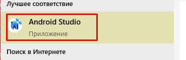
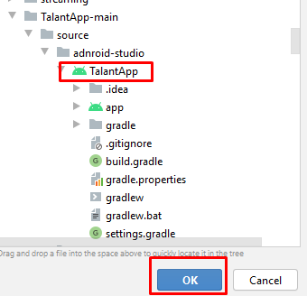

# TalantApp
Это мобильное приложение, которое поможет талантливым ребятам оперативно узнавать о новых мероприятиях (развитие таланта); проходить диагностику навыков и компетенций; постоянно взаимодействовать с наставниками в режиме онлайн.

# 1 - Нажимаем на кнопку "code".

# 2 - Скачиваем проект.

# 3 - Распаковываем наш проект в удомную вам папку.

# 4 - Запускаем Android Studio.

# 5 - Выбираем пункт "Open an Existing Project".

# 6 - Выбираем наш проект и нажимаем "ok".

# 7 - Собираем наш проект (нажимаем на молот) и переходим в директорию проекта.

# 8 - Открываем папку "app".

# 9 - Открываем папку "build".

# 10 - Открываем папку "outputs".

# 11 - Открываем папку "apk".

# 12 - Открываем папку "debug".

# 13 - Пересылаем наше приложение на телефон или на эмулятор.

# 14 - Открываем и устанавливаем приложение на телефоне или на эмуляторе.

# 15 - Теперь можете пользоваться!
